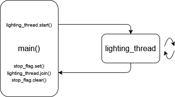

### Overview
The backend for the light tube controller manages all hardware for the project. This document highlights the setup and operation for PWM control of the light tubes. Three sections detail all aspects of the system, [Dependencies](#Dependencies), [Lighting Control](#Lighting%20Control), and [Timing Control](#Timing%20Control).
### Dependencies
The light tube controller is designed to run on a Raspberry Pi single-board computer. Testing was performed on a Raspberry Pi 4 with 4GB RAM. Below are the dependencies, packages, and setup required to run the three backend programs on the Raspberry Pi 4 with Raspberry Pi OS.
#### System
The following commands ensure that all required system dependencies are installed:
```
-- update system packages --
$ sudo apt update -y
$ sudo apt upgrade -y

-- enable i2c communication --
$ sudo raspi-config nonint do_i2c 0

-- install required packages for programs --
$ sudo apt install swig python3-dev build-essential
$ sudo apt install liblgpio-dev
$ sudo apt-get install sqlite3
```
#### Virtual Environment
The following commands create a Python virtual environment and install the required packages for `controller.py`, `set_rtc.py`, and `sync_clocks.py`:
```
-- create a project directory --
$ mkdir project
$ cd project

-- create and activate the virtual environment --
/project $ python -m venv venv
/project $ source venv/bin/activate

-- install packages within the virtual environment --
(venv) /project $ pip install gpiozero
(venv) /project $ pip install adafruit-blinka
(venv) /project $ pip install adafruit-circuitpython-pca9685
(venv) /project $ pip install adafruit-circuitpython-ds3231
(venv) /project $ pip install lgpio
```

All backend files should be run from within this activated virtual environment.
#### File Structure
tbd

### Lighting Control
PWM signaling to the light tubes is managed by `controller.py`. It is partitioned into four sections: initialization functions, data functions, lighting functions, and the `main()` function.

`controller.py` works in two parts, a thread and thread manager. The `lighting_thread` is responsible for all PWM signaling. It will run indefinitely, if allowed, and has no awareness of the system time, the database, or the hardware inputs. The `main()` function acts as the manager of the `lighting_thread` and controls when it is restarted with new arguments.

<div style="text-align: center;">
  
</div>

The details of this implementation will be explained in the four sections below.
#### Initialization
The initialization functions prepare the PCA9685 PWM LED Driver, SQLite Database, and the 8 bit input bus. There are a total of six initialization functions, three manage hardware and three indicate initialization success to the user.
```python
def initialize_pwm()
def pwm_good(pwm)        # blink red 3 times

def initialize_database()
def database_good(pwm)   # blink yellow 3 times

def initialize_input_bus()
def input_bus_good(pwm)  # blink green 3 times
```

`initialize_pwm()` configures the PCA9685 PWM LED Driver and uses the `board`,`busio`, and `adafruit_pca9685` modules. The PWM frequency is set to 1kHz to avoid flicker. Once finished, this function returns a PCA9685 object `pwm` to be modified by other functions.
```python
def initialize_pwm():  
    # create the I2C bus interface  
    i2c = busio.I2C(board.SCL, board.SDA)
    
    # create a PCA9685 object and set the frequency for LED control  
    pwm = adafruit_pca9685.PCA9685(i2c)  
    pwm.frequency = 1000
    
    return pwm
```

`initialize_database()` configures the SQLite Database `lighting.db` and uses the `sqlite3` module. This function sets a variety of database parameters (PRAGMAs) to prevent blocking between the Python backend and PHP frontend. Once finished, this function returns the database connection `conn` and cursor object `cursor`.
```python
def initialize_database():  
    # connect to SQLite database and get cursor  
    conn = sqlite3.connect('lighting.db')  
    cursor = conn.cursor()
    
    # set WAL mode to avoid blocking between python and PHP  
    cursor.execute("PRAGMA journal_mode = WAL;")
    
    # set sync to normal for fast commits that are still safe from crashes  
    cursor.execute("PRAGMA synchronous = NORMAL;")
    
    # set timeout retry length to 5s in case of lock  
    cursor.execute("PRAGMA busy_timeout = 5000;")
    
    # set max WAL size to 4MB  
    cursor.execute("PRAGMA wal_autocheckpoint = 1000;")
    
    return conn, cursor
```

`initialize_input_bus()` configures the 8 bit input bus and uses the `gpiozero` module. All input bus pins use a single side of the Raspberry Pi 4 GPIO. The pinout for the 40-pin connector is available [here](https://www.raspberrypi.com/documentation/computers/raspberry-pi.html#gpio). Once finished, this function returns a list of pin objects `inputs` to be checked by other functions.
```python
def initialize_input_bus():  
    # provide input pins to use  
    input_pins = [22, 10, 9, 11, 5, 6, 13, 26]
    
    # initialize input_pins as gpiozero DigitalInputDevice class objects  
    inputs = [gpiozero.DigitalInputDevice(pin=pin, pull_up=True) for pin in input_pins]
    
    return inputs
```

All `_good()` functions verify the success of a previous initialization function. Once the PWM object has been created, the light tubes will blink red three times. Once the database has been connected, the light tubes will blink yellow three times. Once the input bus objects have been created, the light tubes will blink green three times. This behavior allows the user to perform very basic troubleshooting. For more information on how this function works, please reference [Lighting](#Lighting).
```python
def pwm_good(pwm):  
    # blink red 3 times on startup  
    for i in range(3):  
        # set red color  
        pwm.channels[0].duty_cycle = 0xffff  
        pwm.channels[1].duty_cycle = 0x0000  
        pwm.channels[2].duty_cycle = 0x0000  
        # hold red for 0.5 second  
        time.sleep(0.5)
        
        # set all channels off  
        pwm.channels[0].duty_cycle = 0x0000  
        pwm.channels[1].duty_cycle = 0x0000  
        pwm.channels[2].duty_cycle = 0x0000  
        # hold off for 0.25 second  
        time.sleep(0.25)
    
    return
```
#### Data
The data functions read and write to the SQLite database, read the state of the 8 bit input bus, and check the system time. Of the eight total data functions, six use the database and two interact with the hardware.
```python
def read_scene_info(cursor, scene_id)
def read_connection_scene(cursor, connection_id)
def color_ids_to_list(cursor, color_ids)
def read_events(cursor)
def read_open_hours(cursor, weekday)
def set_active_connections(conn, cursor, connection_id)

def read_input_bus(inputs)
def check_time()
```

`read_scene_info()` returns all necessary arguments for the `lighting_thread` from the database `lighting.db`. It also makes important conversions from user-specified values to variables for the `lighting_thread`. This function is used to gather arguments for the default scene, as well as the connection scenes.
```python
def read_scene_info(cursor, scene_id):
	# read event scene info from lighting.db
    cursor.execute("SELECT behavior, brightness, speed, color0, color1, color2, color3, color4, color5, color6, color7, color8, color9 FROM scenes WHERE scene_id = ?", (scene_id,))

    # get full default scene row as tuple (tuples aren't real, they can't hurt you)
    row = cursor.fetchone()

    # store event scene table data in variables
    behavior, brightness, speed, color0, color1, color2, color3, color4, color5, color6, color7, color8, color9 = row
```
The `globals().get()` function converts the string from `lighting.db` into a callable memory address for the thread which is returned as `function`. The colors from the database are converted from numbers 1-61 to float values for the `color_list` using `color_ids_to_list()` found below. The `cycle_time` is calculated from the `speed` user setting. The `dimmer` integer is calculated from the `brightness` user setting.
```python
    # turn behavior string into callable lighting function
    function = globals().get(behavior)

    # put all color_id keys into a list
    color_ids = [color0, color1, color2, color3, color4, color5, color6, color7, color8, color9]

    # remove unused colors starting from last
    for i in range(9, -1, -1):
        if color_ids[i] is None:
            del color_ids[i]

    # if all colors were null, add white to the list (keep things from breaking)
    if all(color_id is None for color_id in color_ids):
        color_ids = [1]

    color_list = color_ids_to_list(cursor, color_ids)

    # derive cycle time from speed
    cycle_time = 6 - speed

    # derive dimmer from brightness (1 = 20%, 5 = 100%)
    dimmer = int(0x3333 * (5 - brightness))

    return function, color_list, cycle_time, dimmer
```

`read_connection_scene()` takes an integer `connection_id` and returns the associated `scene_id` to be used by `read_scene_info()`.
```python
def read_connection_scene(cursor, connection_id):
    # increment connection_id for sqlite 1-indexing
    connection_id += 1

    # navigate to scene used in connection in lighting.db
    cursor.execute("SELECT scene FROM connections WHERE connection_id = ?", (connection_id,))

    # get connection scene row (more tuple nonsense)
    row = cursor.fetchone()

    # get scene_id from pulled row
    scene_id = row[0]

    # if scene_id is null, set to 1 (so nothing breaks)
    if scene_id is None:
        scene_id = 1

    return scene_id
```

`color_ids_to_list()` takes the `color_ids` from `read_scene_info()`, reads their associated hex values in the database, and converts the hex values to floats for `color_list`. The colors are stored as hex values instead of floats in the database so they can be easily used on the frontend.
```python
def color_ids_to_list(cursor, color_ids):
    ####################### from ChatGPT #######################
    # Build placeholders for the IN clause
    placeholders = ",".join("?" for _ in color_ids)

    # Query hex values for all needed colors at once
    query = f"""SELECT color_id, hexval FROM colors WHERE color_id IN ({placeholders})"""

    cursor.execute(query, color_ids)
    rows = cursor.fetchall()

    # Map ids to hex strings
    id_to_hex = {row[0]: row[1] for row in rows}

    # Final ordered list of hex values
    colors = [id_to_hex.get(color_id) for color_id in color_ids]
    ############################################################

    # convert hex string into floats
    color_list = []
    for color in colors:
        # create a list for the individual red, green, and blue values
        rgb = []

        # extract each color from the hex value string
        red = color[:2]
        green = color[2:4]
        blue = color[4:]

        # convert string to int (hex format)
        red = int(red, 16)
        green = int(green, 16)
        blue = int(blue, 16)

        # convert int to float
        red = red / 255.0
        green = green / 255.0
        blue = blue / 255.0

        # round float to nearest five hundredth so we have less complex real-time fp calculations
        red = round(red / 0.05) * 0.05
        green = round(green / 0.05) * 0.05
        blue = round(blue / 0.05) * 0.05

        # append rgb values to rgb list
        rgb.append(red)
        rgb.append(green)
        rgb.append(blue)

        # move rgb values to color_list list
        color_list.append(rgb)

    return color_list
```

`read_events()` gathers the event information from the database. It returns the `event_scenes` and `event_dates` lists to be checked in `main()`.
```python
def read_events(cursor):
    # read entire events table
    cursor.execute("SELECT * FROM events")

    # pull the entire table as a list of tuples
    events = cursor.fetchall()

    # extract events table columns into their own lists
    event_scenes = [events[1] for events in events]
    event_dates = [events[2] for events in events]

    return event_scenes, event_dates
```

`read_open_hours()` gathers and returns the business hours for the weekday passed as an integer 0-6.
```python
def read_open_hours(cursor, weekday):
    # read entire time table
    cursor.execute("SELECT * FROM time")

    # pull the entire table as a list of tuples
    hours = cursor.fetchall()

    # extract the business hours depending on the weekday
    open_hour, open_minute, close_hour, close_minute = hours[weekday][1], hours[weekday][2], hours[weekday][3], hours[weekday][4]

    return open_hour, open_minute, close_hour, close_minute
```

`set_active_connections()` updates the database to reflect the currently active connection. This allows the frontend to setup connections more easily.
```python
def set_active_connections(conn, cursor, connection_id):
    # set the active connections to none in the table
    cursor.execute("UPDATE connections SET is_active = 0")

    # if a new connection is active
    if connection_id != 0:
        # set the is_active column to 1 for the active connection
        cursor.execute("UPDATE connections SET is_active = 1 WHERE connection_id = ?", (connection_id,))

    # commit changes to database
    conn.commit()

    return
```

`read_input_bus()` returns the states of the 8 bit input bus so the connections can be monitored by `main()`.
```python
def read_input_bus(inputs):
    # gather states from inputs
    states = [i.value for i in inputs]

    return states
```

`check_time()` returns a string of the date in ISO 8601 format (`YYYY-MM-DD`), as well as the current hour and time of the Raspberry Pi 4 system clock.
```python
def check_time():
    # get time struct from pi clock
    now = datetime.datetime.now()

    # get ISO 8601 string of today's date
    today = datetime.date.today()
    date_string = today.isoformat()

    return date_string, now.hour, now.minute
```

#### Lighting
The lighting functions communicate with the PCA9685 PWM LED Driver to create a variety of visual effects. There are nine lighting functions that can be selected by the user. The first three channels of the PCA9685 control the red, green, and blue channels of the light tubes, respectively. Each channel accepts an integer value 0-65535, or 0x0000-0xffff.
```python
# set green color  
pwm.channels[0].duty_cycle = 0x0000  
pwm.channels[1].duty_cycle = 0xffff  
pwm.channels[2].duty_cycle = 0x0000
```

Each function uses the same four arguments:
* `pwm`, the PWM object 
* `color_list`, a nested list of floats representing colors (any length)
* `cycle_time`, an integer for the number of seconds to loop each function (1-5)
* `dimmer`, an integer to reduce the brightness of the light tubes (0-65535)
```python
# nested list of floats for colors
color_list = [[0, 1, 1], [0.5, 0, 1], [0.0, 1.0, 0]]

# integer for loop time in seconds
cycle_time = 3

# integer to reduce brightness
dimmer = 0x3333
```

Additionally, each function is run by a thread and loops indefinitely until a flag to stop is raised.
```python
# thread global flag  
stop_flag = threading.Event()

# inside function --- check for raised flag during the cycle_time timeout  
if stop_flag.wait(timeout=cycle_time):  
    return None
```

There are two types of lighting functions, `sequence` and `crossfade`. The `sequence` functions perform a unique behavior while holding a single color, then perform the behavior on the next color in `color_list`. 
```python
def sequence_solid(pwm, color_list, cycle_time, dimmer)
def sequence_fade(pwm, color_list, cycle_time, dimmer)
def sequence_decay(pwm, color_list, cycle_time, dimmer)
def sequence_morse(pwm, color_list, cycle_time, dimmer)
def sequence_wigwag(pwm, color_list, cycle_time, dimmer)
def sequence_sos(pwm, color_list, cycle_time, dimmer)
def sequence_breathe(pwm, color_list, cycle_time, dimmer)
```

Aside from `sequence_solid()`, which holds each color in `color_list` at the same brightness, the `sequence` functions use a lookup table (LUT) to create various effects. In `sequence_fade()`, the brightness of each color follows a sine wave, meaning it gradually fades in and out. The `cycle_time` argument is divided by 100 to reflect the length of the lookup table, and the length of the `color_list` argument is used to define the number of loops each time the function restarts. Since each color channel will not always be set to the maximum brightness, the `dimmer` value scales so it behaves as a percentage.
```python
def sequence_fade(pwm, color_list, cycle_time, dimmer):  
    # lookup table for function  
    fade = [0x0, 0x41, 0x102, 0x244, 0x405, 0x644, 0x8fd, 0xc2f, 0xfd5, 0x13ed, 0x1872, 0x1d60, 0x22b1, 0x2861, 0x2e69, 0x34c3, 0x3b6a, 0x4256, 0x4980, 0x50e1, 0x5872, 0x602b, 0x6803, 0x6ff5, 0x77f6, 0x7fff, 0x8809, 0x900a, 0x97fc, 0x9fd4, 0xa78d, 0xaf1e, 0xb67f, 0xbda9, 0xc495, 0xcb3c, 0xd196, 0xd79e, 0xdd4e, 0xe29f, 0xe78d, 0xec12, 0xf02a, 0xf3d0, 0xf702, 0xf9bb, 0xfbfa, 0xfdbb, 0xfefd, 0xffbe, 0xffff, 0xffbe, 0xfefd, 0xfdbb, 0xfbfa, 0xf9bb, 0xf702, 0xf3d0, 0xf02a, 0xec12, 0xe78d, 0xe29f, 0xdd4e, 0xd79e, 0xd196, 0xcb3c, 0xc495, 0xbda9, 0xb67f, 0xaf1e, 0xa78d, 0x9fd4, 0x97fc, 0x900a, 0x8809, 0x8000, 0x77f6, 0x6ff5, 0x6803, 0x602b, 0x5872, 0x50e1, 0x4980, 0x4256, 0x3b6a, 0x34c3, 0x2e69, 0x2861, 0x22b1, 0x1d60, 0x1872, 0x13ed, 0xfd5, 0xc2f, 0x8fd, 0x644, 0x405, 0x244, 0x102, 0x41]
      
    # create smaller time increment for loop
    step_time = cycle_time / 100
      
    # get color_list length
    num_colors = len(color_list)
    
    while True:  
        for color in range(num_colors):  
            for i in range(100):  
                # assign LUT value to color channels minus the scaled dimmer value
                pwm.channels[0].duty_cycle = int((color_list[color][0]
                    * int(fade[i] - ((fade[i] / 0xffff) * dimmer))))  
                pwm.channels[1].duty_cycle = int((color_list[color][1]
					* int(fade[i] - ((fade[i] / 0xffff) * dimmer))))  
                pwm.channels[2].duty_cycle = int((color_list[color][2]
	                * int(fade[i] - ((fade[i] / 0xffff) * dimmer))))  
		        
                # check for raised flag during the step_time timeout
                if stop_flag.wait(timeout=step_time):  
                    return None
```

The `crossfade` functions gradually transition between each color in `color_list` and may also perform a behavior on each listed color.
```python
def crossfade(pwm, color_list, cycle_time, dimmer)
def crossfade_hold(pwm, color_list, cycle_time, dimmer)
```

In `crossfade()`, each color transitions into the next without stopping on the colors in `color_list`. There are a variable number of steps between each color depending on the transition speed defined by `cycle_time`. The differences in color values between colors are stored in the `color_difference` list. Then, colors are moved between as the number of steps between colors matches the maximum per color, which was defined by the `increment_dict` dictionary. There is additional logic to prevent errors if a `color_list` with a single color is used as an argument.
```python
def crossfade(pwm, color_list, cycle_time, dimmer):
    # create smaller time increment for loop and set increment count
    step_time = 0.025

    increment_dict = {
        1: 10,
        2: 20,
        3: 30,
        4: 40,
        5: 50
    }

    inc = increment_dict[cycle_time]

    # get color_list length
    num_colors = len(color_list)

    while True:
        for color in range(len(color_list)):
            # get current color and next color for transition
            if color == num_colors - 1:
                current_color = color_list[color]
                next_color = color_list[0]
                color_difference = [a - b for a, b in zip(next_color, current_color)]

                for i in range(1, inc + 1):
                    # assign current color values with progressive difference from next color
                    pwm.channels[0].duty_cycle = int(current_color[0] * (0xffff - dimmer)) + int((color_difference[0] * i * (0xffff - dimmer)) / inc)
                    pwm.channels[1].duty_cycle = int(current_color[1] * (0xffff - dimmer)) + int((color_difference[1] * i * (0xffff - dimmer)) / inc)
                    pwm.channels[2].duty_cycle = int(current_color[2] * (0xffff - dimmer)) + int((color_difference[2] * i * (0xffff - dimmer)) / inc)

                    # check for raised flag during the step_time timeout
                    if stop_flag.wait(timeout=step_time):
                        return None

            # get current color and next color for transition
            else:
                current_color = color_list[color]
                next_color = color_list[color + 1]
                color_difference = [a - b for a, b in zip(next_color, current_color)]

                for i in range(1, inc + 1):
                    # assign current color values with progressive difference from next color
                    pwm.channels[0].duty_cycle = int(current_color[0] * (0xffff - dimmer)) + int((color_difference[0] * i * (0xffff - dimmer)) / inc)
                    pwm.channels[1].duty_cycle = int(current_color[1] * (0xffff - dimmer)) + int((color_difference[1] * i * (0xffff - dimmer)) / inc)
                    pwm.channels[2].duty_cycle = int(current_color[2] * (0xffff - dimmer)) + int((color_difference[2] * i * (0xffff - dimmer)) / inc)

                    # check for raised flag during the step_time timeout
                    if stop_flag.wait(timeout=step_time):
                        return None
```
#### Main
The `main()` function is separated into two sections, startup and the lighting loop. In startup, `main()` calls all of the [Initialization](#Initialization) functions, reads all information for the default scene, starts the loop with that information, then creates two status variables for the loop, `lights_off` and `connection_was_running`. The `lights_off` variable prevents unnecessary reads from the database when the business is outside of operating hours. The `connection_was_running` variable ensures the database shows all connections as off once there are no longer any active connections.
```python
def main():
    # -------------- initialization and startup ----------------

    # create pwm object for light control
    pwm = initialize_pwm()

    # indicate pwm object has been initialized
    pwm_good(pwm)

    # load sqlite database for program
    conn, cursor = initialize_database()

    # indicate database has been initialized
    database_good(pwm)

    # initialize input bus for hardware inputs
    inputs = initialize_input_bus()

    # indicate input bus has been initialized
    input_bus_good(pwm)

    # read default scene info from scenes table
    function, color_list, cycle_time, dimmer = read_scene_info(cursor, scene_id=1)

    # start lighting thread with default scene info
    lighting_thread = threading.Thread(target=function, args=(pwm, color_list, cycle_time, dimmer))
    lighting_thread.start()

    # create status variable to track if lighting is disabled
    lights_off = False

    # create status variable to see if a connection was just running
    connection_was_running = False
```

The lighting thread loop has a defined hierarchy to determine when and how the light tubes should be controlled. The hierarchy is as follows:
1. Connections: if a connection receives power, then it will be given control
2. Time: if no connections are active AND the business is closed, then lighting will be disabled
3. Event: if no connections are active, the business is open, AND today is an event day, then event lighting will be displayed
4. Default: if no other level has control, then default lighting will be displayed

Each control path within the loop has a delay of 100ms to avoid excessive reads and writes to and from the database. The user experiences an average delay of 50ms when switching between connections or making changes to the database. Each control path checks if the lighting thread needs to be restarted, then restarts it with new arguments gathered from the database via `read_scene_info()`.
```python
while True:
        # check current state of input bus
        states = read_input_bus(inputs)

        # if any connections are currently active
        if any(states):
            # set connection status to running
            connection_was_running = True

            # return the lowest index that is true
            connection = states.index(True)

            # get the scene_id for the connection
            scene_id = read_connection_scene(cursor, connection_id=connection)

            # and check the associated scene info
            temp_function, temp_color_list, temp_cycle_time, temp_dimmer = read_scene_info(cursor, scene_id)

            # if the scene info has not changed from the last connection's scene info
            if (temp_function, temp_color_list, temp_cycle_time, temp_dimmer) == (function, color_list, cycle_time, dimmer):
                # wait for 100ms and loop again
                time.sleep(0.1)
                continue

            # if the scene info has changed
            else:
                # update the database to reflect the active connection (+1 for sqlite 1-indexing)
                set_active_connections(conn, cursor, connection + 1)

                # get the new scene info
                function, color_list, cycle_time, dimmer = temp_function, temp_color_list, temp_cycle_time, temp_dimmer

                # stop the lighting thread
                stop_flag.set()
                lighting_thread.join()
                stop_flag.clear()

                # and restart the lighting thread with the new scene info
                lighting_thread = threading.Thread(target=function, args=(pwm, color_list, cycle_time, dimmer))
                lighting_thread.start()

                # wait for 100ms and loop again
                time.sleep(0.1)
                continue

        # if no connections are currently active
        else:
            # check if connection was just running
            if connection_was_running:
                # set running to false
                connection_was_running = False
                # set all connections as off in table
                set_active_connections(conn, cursor, connection_id=0)

            # get system weekday
            today = datetime.datetime.today()
            weekday = today.weekday()

            # check time table for up-to-date business hours
            open_hour, open_minute, close_hour, close_minute = read_open_hours(cursor, weekday)

            # check the current time
            curr_date, curr_hour, curr_minute = check_time()

            # manage all possible hour scenarios
            if open_hour <= close_hour:
                # normal hours like 9a-5p
                is_open = (open_hour, open_minute) <= (curr_hour, curr_minute) < (close_hour, close_minute)
            else:
                # overnight hours like 10:30a-1a (wingstop case)
                is_open = (curr_hour, curr_minute) >= (open_hour, open_minute) or (curr_hour, curr_minute) < (close_hour, close_minute)

            # if the current time is within business hours
            if is_open:
                # set off as not running
                lights_off = False

                # check events table for up-to-date event dates
                event_scenes, event_dates = read_events(cursor)

                # check if current date is event date
                try:
                    event_index = event_dates.index(curr_date)
                except ValueError:
                    event_index = -1

                # if current day is present on event table
                if event_index != -1:
                    # check the associated scene info
                    temp_function, temp_color_list, temp_cycle_time, temp_dimmer = read_scene_info(cursor, scene_id = event_scenes[event_index])

                    # if the scene info has not changed from the last scene's info
                    if (temp_function, temp_color_list, temp_cycle_time, temp_dimmer) == (function, color_list, cycle_time, dimmer):
                        # wait for 100ms and loop again
                        time.sleep(0.1)
                        continue

                    # if the scene info has changed
                    else:
                        # get the new scene info
                        function, color_list, cycle_time, dimmer = temp_function, temp_color_list, temp_cycle_time, temp_dimmer

                        # stop the lighting thread
                        stop_flag.set()
                        lighting_thread.join()
                        stop_flag.clear()

                        # and restart the lighting thread with new scene info
                        lighting_thread = threading.Thread(target=function, args=(pwm, color_list, cycle_time, dimmer))
                        lighting_thread.start()

                        # wait for 100ms and loop again
                        time.sleep(0.1)
                        continue

                # if current day is not event day
                else:
                    # check the default scene info
                    temp_function, temp_color_list, temp_cycle_time, temp_dimmer = read_scene_info(cursor, scene_id=1)

                    # if the scene info has not changed from the last scene's info
                    if (temp_function, temp_color_list, temp_cycle_time, temp_dimmer) == (function, color_list, cycle_time, dimmer):
                        # wait for 100ms and loop again
                        time.sleep(0.1)
                        continue

                    # if the scene info has changed
                    else:
                        # get the new scene info
                        function, color_list, cycle_time, dimmer = temp_function, temp_color_list, temp_cycle_time, temp_dimmer

                        # stop the lighting thread
                        stop_flag.set()
                        lighting_thread.join()
                        stop_flag.clear()

                        # and restart the lighting thread with new scene info
                        lighting_thread = threading.Thread(target=function, args=(pwm, color_list, cycle_time, dimmer))
                        lighting_thread.start()

                        # wait for 100ms and loop again
                        time.sleep(0.1)
                        continue

            # if the current time is not within business hours
            else:
                # check if current time has just left business hours
                if not lights_off:
                    # set lights as off
                    lights_off = True

                    # stop the lighting thread
                    stop_flag.set()
                    lighting_thread.join()
                    stop_flag.clear()

                    # set scene info for lights off
                    function, color_list, cycle_time, dimmer = globals().get("sequence_solid"), [[0.0, 0.0, 0.0]], 1, 0

                    # and restart the lighting thread with new info
                    lighting_thread = threading.Thread(target=sequence_solid, args=(pwm, color_list, cycle_time, dimmer))
                    lighting_thread.start()

                    # wait for 100ms and loop again
                    time.sleep(0.1)
                    continue

                # if off lighting has been running for at least one loop
                else:
                    # wait for 100ms and loop again
                    time.sleep(0.1)
                    continue
```
### Timing Control
Timing for the controller is managed by `set_rtc.py` and `sync_clocks.py`.

`set_rtc.py` controls the DS3231 real-time clock. It is run from the command line and expects an ISO8601 formatted string as an argument. Below are a few examples of acceptable file execution from within the project virtual environment.
```
python set_rtc.py 2026-02-11T15:07:05
python set_rtc.py 2026-10-31T11:59
python set_rtc.py 2026-02-08T18:30:00.000
```

Within the file, the DS3231 is initialized.
```python
# initialize i2c bus
i2c = busio.I2C(board.SCL, board.SDA)

# initialize rtc object
rtc = adafruit_ds3231.DS3231(i2c)
```

Next, the ISO8601 string argument is parsed and sliced. When the time is set on the Raspberry Pi 4, the seconds will be set to 0 regardless of the string. As such, there is no variable for seconds in this file.
```python
# create argument for ISO8601 date string
parser = argparse.ArgumentParser()
parser.add_argument("ISO_date")

# get date string
args = parser.parse_args()
date = args.ISO_date

# slice string into variables
year = int(date[:4])
month = int(date[5:7])
day = int(date[8:10])
hour = int(date[11:13])
minute = int(date[14:16])
```

Then, the weekday and yearday are calculated using the `datetime` library's functions.
```python
# get weekday for DS3231
date_object = datetime.date(year, month, day)
weekday = date_object.weekday()

# get yearday for DS3231
temp_struct = time.struct_time((year, month, day, hour, minute, 0, 0, 0, -1))
epoch = time.mktime(temp_struct)
computed = time.localtime(epoch)
```

Finally, the DS3231 is set with all of the given and calculated variables. The daylight savings field is not utilized by the real-time clock, so it is set to -1.
```python
# set rtc with string info, weekday, and yearday
rtc.datetime = time.struct_time((year, month, day, hour, minute, 0, weekday, computed.tm_yday, -1))
```

`sync_clocks.py` reads the date and time from the DS3231, and runs a command to synchronize the DS3231 and Raspberry Pi 4 system clock. The real-time clock is initialized at the start of the file.
```python
# initialize i2c bus
i2c = busio.I2C(board.SCL, board.SDA)

# initialize rtc object
rtc = adafruit_ds3231.DS3231(i2c)
```

The rest of the file loops continuously and synchronizes the two clocks every five minutes.
```python
while True:
    # get current time from rtc
    now = rtc.datetime

    # create ISO8601 string from rtc values
    date_string = "{:04d}-{:02d}-{:02d}T{:02d}:{:02d}:{:02d}".format(now.tm_year, now.tm_mon, now.tm_mday, now.tm_hour, now.tm_min, now.tm_sec)

    # run command to set raspberry pi clock
    os.system(f'sudo date --set "{date_string}"')

    # wait 5 minutes to sync clocks again
    time.sleep(300)
```