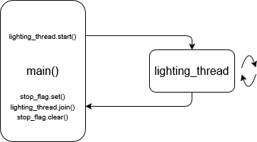

# Overview
This document outlines all programs that comprise the PWM Lighting Controller. Hardware control is implemented in Python, databases use SQLite, and the web application is written in PHP.

System setup and requirements are discussed first, followed by hardware control, then database structure, and finally the web application. These sections are outlined and can be navigated via the Table of Contents.

[Gitea](http://stserver:3000/andrewr/pwm-lighting-controller)

# Table of Contents
### [System](#System)
[Required Hardware](#Required%20Hardware)
[Setup Commands and File Structure](#Setup%20Commands%20and%20File%20Structure)
[Network](#Network)
### [Databases](#Databases)
### [Web Application](#Web%20Application)
[Users](#Users)
[Home](#Home)
[Scenes](#Scenes)
[Connections](#Connections)
[Schedule](#Schedule)
[Setup Guide](#Setup%20Guide)
[Settings](#Settings)
### [Hardware Control](#Hardware%20Control)
[Lighting](#Lighting)
[Timing](#Timing)
[Reset](#Reset)

# System
### Required Hardware
This project was designed to run on a Raspberry Pi 4 Model B 4GB running Raspberry Pi OS Lite (64-bit). The Pi interfaces with the Signal-Tech Light Tube Controller board, which handles PWM signaling, manages timing, and has a system reset button and status LEDs.

Any Raspberry Pi 4 Model B with at least 4GB of RAM will work. A Pi 5 with sufficient RAM should work, but this has not been tested.

### Setup Commands and File Structure
When flashing Raspberry Pi OS Lite (64-bit), the hostname should be `raspberrypi`, the user should be `user`, and the password should be `pass`.

On a new device connected to a network, run the following commands to update and upgrade the system packages:
```
$ sudo apt update -y
$ sudo apt upgrade -y
$ sudo reboot
```

The following system-wide commands are required to use the I<sup>2</sup>C bus and control GPIO:
```
$ sudo raspi-config nonint do_i2c 0

$ sudo apt install swig python3-dev build-essential -y
$ sudo apt install liblgpio-dev
```

##### `/home/user/project` Directory
A Python virtual environment is required to run the [Hardware Control](#Hardware%20Control) files, it can be created and configured with the following commands:
```
$ mkdir project
$ cd project

/project $ python -m venv venv
/project $ source venv/bin/activate

(venv) /project $ pip install numpy
(venv) /project $ pip install gpiozero
(venv) /project $ pip install adafruit-blinka
(venv) /project $ pip install adafruit-circuitpython-pca9685
(venv) /project $ pip install adafruit-circuitpython-ds3231
(venv) /project $ pip install lgpio
```

Alternatively, the virtual environment dependencies can be installed automatically via `requirements.txt`. This file is available in the Gitea repository at `pwm-lighting-controller/docs`. Once the requirements file is placed in the `project` directory, run the following command:
```
(venv) /project $ pip install -r requirements.txt
```

You can deactivate the Python virtual environment with:
```
(venv) /project $ deactivate
```

Within the `project` directory, two additional directories are required. Create them with the following command:
```
/project $ sudo mkdir backend database
```

The `backend` and `database` directories hold all Python and SQLite files, respectively. In the GitHub repository these files are found in `pwm-lighting-controller/app/py` and `pwm-lighting-controller/app/db`. Move all of the `.py` and `.db` files found there into their directories. The file structure of the `project` directory should be:
```
project
├─ backend
│   ├─ controller.py
│   ├─ fubar.py
│   ├─ set_rtc.py
│   └─ sync_clocks.py
├─ database
│   ├─ factory_settings.db
│   └─ lighting.db
└─ venv
```

##### `/var/www/html` Directory
The web application uses Apache, PHP, and SQLite, all of which need to be installed:
```
$ sudo apt install apache2 -y
$ sudo apt install php -y
$ sudo apt install libapache2-mod-php 
$ sudo apt install sqlite3
$ sudo apt install php-sqlite3 -y
```

The Apache service should be started after installation:
```
$ sudo systemctl enable apache2
$ sudo systemctl start apache2
```

Once Apache is installed, a new folder will be created. Navigate to it with the following command:
```
$ cd /var/www/html
```

The `html` directory holds all PHP files. In the Gitea repository these files are found in `pwm-lighting-controller/app/php`. Move all of the `.php` files found there into the `html` directory. Within the `html` directory, three additional directories are required. Create them with the following command:
```
/var/www/html $ sudo mkdir assets css includes
```

The `assets`, `css`, and `includes` directories hold all project images and icons, the Tailwind CSS file, and commonly used PHP files, respectively. In the Gitea repository these files are found in `pwm-lighting-controller/assets`, `pwm-lighting-controller/app/css`, and `pwm-lighting-controller/app/php/includes`, respectively. All files and folders in each of these locations should be placed in their corresponding directories. The file structure of the `html` directory should be:
```
html
├─ assets
│   ├─ colors
│   │   ├─ blue1.svg
│   │   ├─ blue2.svg
│   │   ├─ blue3.svg
│   │   └─ 61 more...
│   ├─ back.svg
│   ├─ help.svg
│   ├─ home.svg
│   ├─ logo.svg
│   ├─ pencil.svg
│   ├─ plus.svg
│   └─ refresh.svg
├─ css
│   └─ tailwind.min.css
├─ includes
│   ├─ session-check.php
│   └─ user-check.php
├─ add-event.php
├─ add-scene.php
├─ connections.php
├─ edit-connection.php
├─ edit-date-time.php
├─ edit-event.php
├─ edit-lighting-schedule.php
├─ edit-scene.php
├─ forgot-user-pass.php
├─ home.php
├─ index.php
├─ index.html
├─ register.php
├─ reset.php
├─ scenes.php
├─ schedule.php
├─ settings.php
├─ setup-guide.php
└─ test.php
```

The `index.html` file needs to be removed.
```
/var/www/html $ sudo rm index.html
```

Once the `html` directory is complete, the Apache user, `www-data`, will require specific file permissions, and certain files and directories must be modified. Run the following commands:
```
$ sudo chown -R user:www-data /home/user/project/database  
$ sudo chmod -R 775 /home/user/project/database

$ chmod 2775 /home/user/project/database  
  
$ chmod 664 /home/user/project/database/lighting.db  
$ chmod 664 /home/user/project/database/factory_settings.db  
  
$ chmod 755 /home/user
$ chmod 755 /home/user/project
```

##### `/etc/systemd/system` Directory
The final directory to configure is the `system` directory. Navigate to it with the following command:
```
$ cd /etc/systemd/system
```

The `system` directory holds all systemd service files. In the GitHub repository these files are found in `pwm-lighting-controller/app/service`. Move all of the `.service` files found there into the `system` directory. Many system files are stored here, but the files for this project will be structured as follows:
```
system
├─ controller.service
├─ fubar.service
├─ set_rtc.service
└─ sync_clocks.service
```

These services need to be enabled and started once they are moved:
```
$ sudo systemctl enable controller.service
$ sudo systemctl start controller.service

$ sudo systemctl enable fubar.service
$ sudo systemctl start fubar.service

$ sudo systemctl enable set_rtc.service
$ sudo systemctl start set_rtc.service

$ sudo systemctl enable sync_clocks.service
$ sudo systemctl start sync_clocks.service

$ sudo systemctl restart apache2
```

The light tubes should flash red, then yellow, then green and finally transition to a rainbow.

### Network
The Raspberry Pi 4 Model B can be configured to host a Wi-Fi network (hotspot). This is the intended method for connecting to the web application. Run the following commands to configure and enable it:
```
$ nmcli device wifi hotspot ssid st-lighting password SignalTech26
$ nmcli connection show
$ nmcli connection modify Hotspot 802-11-wireless.hidden yes

$ nmcli connection modify "netplan-wlan0-signaltech-guest" connection.autoconnect no
$ nmcli connection modify "Hotspot" connection.autoconnect yes

$ nmcli connection modify "Hotspot" connection.autoconnect-priority 100
$ nmcli connection modify "netplan-wlan0-signaltech-guest" connection.autoconnect-priority 0

$ nmcli connection up "Hotspot"
```

Connect to the hidden SSID `st-lighting` with the password `SignalTech26`. Once connected, open a browser and go to `http://10.42.0.1/`. The account registration page should be displayed.

# Databases
Two SQLite databases hold all information used by the web application and the hardware control, `lighting.db` and `factory_settings.db`. These files hold the same contents, but their use differs. `lighting.db` can be modified by the user via the web application. Any changes the user makes will exist here. `factory_settings.db` contains a backup to reset the controller if a reset is requested by the user, or the physical reset button is held for 10 seconds.

The tables within these files are detailed below:
```
clock            -- for user to set a new time, with flag to demand update
colors           -- holds all 64 colors with name and hex value
connections      -- shows active connection and holds associated scene and note
events           -- holds event dates, associated scenes and notes
scenes           -- holds color, behavior, speed, and brightness values
sqlite_sequence  -- sqlite primary key table
testmode         -- holds scene information and flags for test scene feature
time             -- holds all user set business/operational hours
users            -- holds username and hashed password for single account
```

# Web Application
The logical structure of the web app is detailed below.
```
register.php
index.php
└── forgot-user-pass.php
└── home.php
     ├── scenes.php
     |    ├── add-scene.php
     |    └── edit-scene.php
     ├── connections.php
     |    └── edit-connection.php
     ├── schedule.php
     |    ├── add-event.php
     |    ├── edit-event.php
     |    └── edit-lighting-schedule.php
     ├── setup-guide.php
     └── settings.php
          └── edit-date-time.php
          └── reset.php
```
### Users
To use the web application an account must exist and the account must be logged in. The number of accounts is not technically limited, but if an account exists, then the account creation page, `register.php`, will redirect to `index.php`, the log in page. If the user forgets their account information and cannot log in, the `Help` button can be pressed on `index.php` that links to `forgot-user-pass.php`. This page contains reset instructions. Essentially, "hold the reset button for 10 seconds".
### Home
sdfg
### Scenes
sdfg
### Connections
sdfg
### Schedule
sdfg
### Setup Guide
safdg
### Settings
kjhlkj

# Hardware Control
The Raspberry Pi, PCA9685 PWM IC, and DS3231 Real-Time Clock are controlled by Python daemons.
### Lighting
`controller.py` controls the PWM IC and manages all data necessary to run lighting scenes on PWM lighting devices. This program also reads the eight inputs on the Light Tube Controller board and reports their status. When this program is running, the STAT1 LED will blink.

This program has an observable startup sequence. When started, the lights will blink red after the PWM chip is initialized, then yellow after connecting to the database, and finally green after connecting to the 8-bit input bus. 

A `while` loop runs indefinitely to read updates from the database and change the active lighting. The PWM signaling is controlled by a thread and is restarted by the `main` function when the user has requested a change, or an event or connection becomes active.


Three arguments are required to run the lighting thread:
* `color_list`, a list of up to 10 colors each represented as three floats
* `cycle_time`, an integer for the number of seconds to show each color
* `dimmer`, and integer offset to reduce the brightness of the lights

These arguments are not present in the database. Instead, they are generated from user-selected values. Within `lighting.db`, colors are represented as hex values, and the brightness and speed values are set between one and five. Functions like `read_scene_info()` handle these conversions:
```python
# put all color_id keys into a list
color_ids = [color0, color1, color2, ..., color9]

# remove unused colors starting from last
for i in range(9, -1, -1):
if color_ids[i] is None:
	del color_ids[i]

# if all colors were null, add black to the list (keep things from breaking)
if all(color_id is None for color_id in color_ids):
	color_ids = [64]

color_list = color_ids_to_list(cursor, color_ids)

# derive cycle time from speed
cycle_time = 6 - speed

# derive dimmer from brightness (1 = 10%, 10 = 100%)
dimmer = int(0x3333 * (5 - brightness))
```

The eight lighting functions have slightly different uses for these arguments, but they generally operate in the same manner. Below is the implementation for the `sequence_solid` function. Notice how the floating point color values are applied to the color channels at full intensity minus the `dimmer` value and switch colors after the `cycle_time` timeout has expired.
```python
def sequence_solid(pwm, color_list, cycle_time, dimmer):
    # get color_list length
    num_colors = len(color_list)

    while True:
        for color in range(num_colors):
            # assign full value to color channels minus the scaled dimmer value
			pwm.channels[0].duty_cycle = int(color_list[color][0] * (0xffff - dimmer))
			pwm.channels[1].duty_cycle = int(color_list[color][1] * (0xffff - dimmer))
			pwm.channels[2].duty_cycle = int(color_list[color][2] * (0xffff - dimmer))

            # check for raised stop flag during the cycle_time timeout
            if stop_flag.wait(timeout=cycle_time):
                return None
```

The web app allows users to 


### Timing
set_rtc.py
sync_clocks.py
### Reset
fubar.py